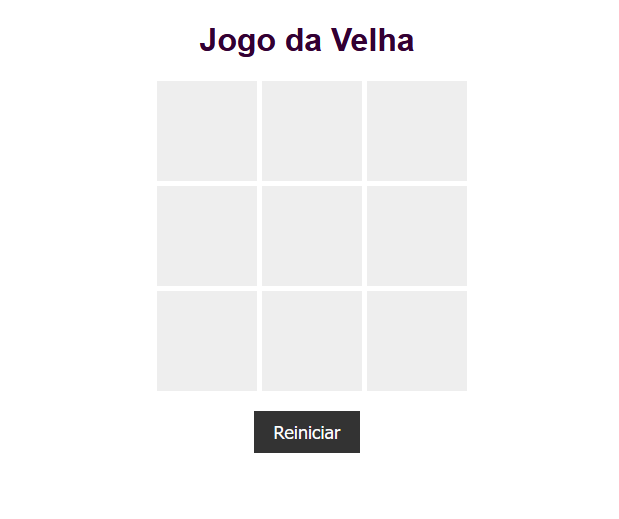

# Jogo da Velha

Este é um simples jogo da velha (tic-tac-toe) implementado em HTML, CSS e JavaScript. É um jogo para dois jogadores, onde eles podem alternar entre 'X' e 'O' para fazer suas jogadas.

## Como Jogar

1. Abra o arquivo `index.html` em seu navegador web.
2. Clique em qualquer célula vazia do tabuleiro para fazer sua jogada.
3. Os jogadores alternam entre 'X' e 'O' a cada jogada.
4. O primeiro jogador a formar uma linha horizontal, vertical ou diagonal com seu símbolo vence o jogo.
5. Se todas as células estiverem preenchidas e não houver um vencedor, o jogo termina em empate.

## Recursos

- Interface simples e intuitiva.
- Verificação automática de vitória ou empate.
- Possibilidade de reiniciar o jogo a qualquer momento.

## Personalização

Você pode personalizar a aparência do jogo alterando o arquivo `style.css`. Sinta-se à vontade para modificar o estilo, cores e fontes de acordo com suas preferências.

## Contribuições

Contribuições são bem-vindas! Sinta-se à vontade para abrir problemas (issues) e enviar solicitações de pull (pull requests) para melhorar este jogo.

---

Divirta-se jogando o Jogo da Velha!
